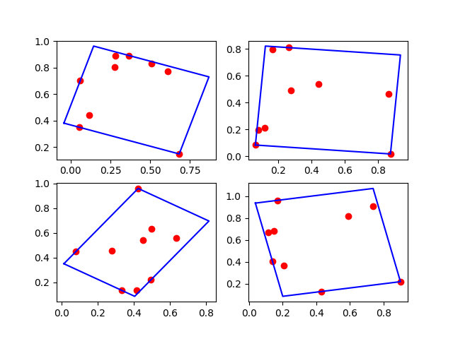
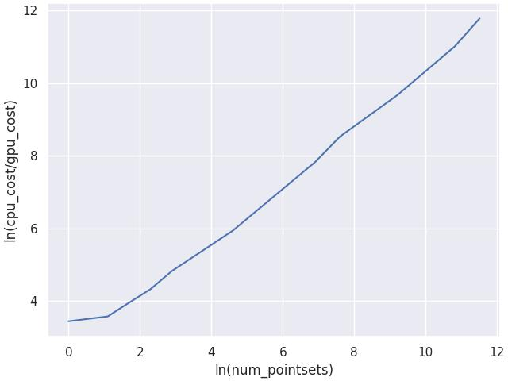

# Minimum Area Rectangle CUDA Operator(MARCO)

## Overview
Overview
The Minimum Area Rectangle CUDA Operator is a GPU-accelerated implementation for finding the minimum area rectangle that encloses a given set of points. This operator is designed to efficiently compute the minimum area rectangle using CUDA, taking advantage of parallel processing on NVIDIA cuda kernel. 



## How fast we are?
We test our operator in cpu and gpu by applying different number of pointset as our parameters. 
From the plot, we can see that our operator is more efficient than the CPU operator on a large number of pointsets.


## Environments
* Device: NVIDIA GeForce RTX 4090(You can use this operator in any nvidia device)
* Ubuntu 20.04.2
* NVIDIA Driver: 550.54.14
* CUDA: 11.6
* Python: 3.8.18
* PyTorch: 1.9.0+cu111
* GCC: 9.4.0

## Code structure
```shell
├── include
│   └── min_area_rect.h # cpu operator folder
├── cpu_operator
│   └── min_area_rect_cpu.py # cpu operator script
│   └── min_area_rect.ipynb # skatch notebook for opeator and showing result
├── kernel
│   └── min_area_rect.cu # cuda kernel
├── pytorch
│   ├── min_area_rect_ops.cpp # torch wrapper of add2 cuda kernel
│   ├── setup.py
│   ├── test.py # use to validate operator
│   └── CMakeLists.txt
├── time_metric.py # measure operator metric
└── README.md
```

**Setuptools**  
```shell
python pytorch/setup.py install
```

**Usage**

see example.py
```python
import torch
import min_area_rect
import numpy as np
import time

if __name__=="__main__":
    N = 9 # number of points
    # test using the simplest example
    num_pointsets = [1,3,5,10,18,100,1000, 2000, 10000, 50000, 100000]
    device = torch.device('cuda:0')
    for num_pointset in num_pointsets:
        # GPU operator test
        simplest_data = np.random.random([num_pointset ,2*N]) # [1, 18] 
        simplest_data_gpu = torch.Tensor(simplest_data).to(device)

        gpu_result = torch.Tensor(np.zeros([num_pointset, 8])).to(device)
        oper_begin = time.time()
        min_area_rect.torch_launch_min_area_rect(simplest_data_gpu, gpu_result)
        oper_end = time.time()
        gpu_time = oper_end - oper_begin
        print(f"GPU version-> avg time: {gpu_time/num_pointset * 1e-9}, num_pointsets: {num_pointset}")
```